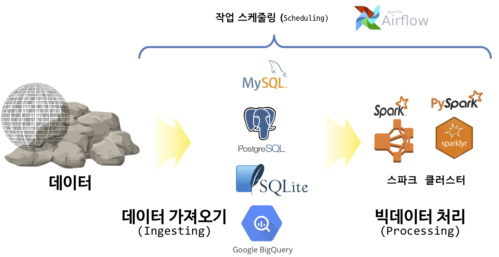
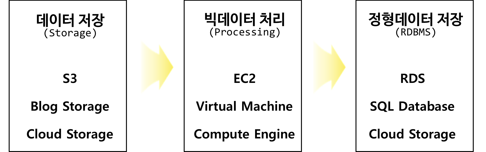
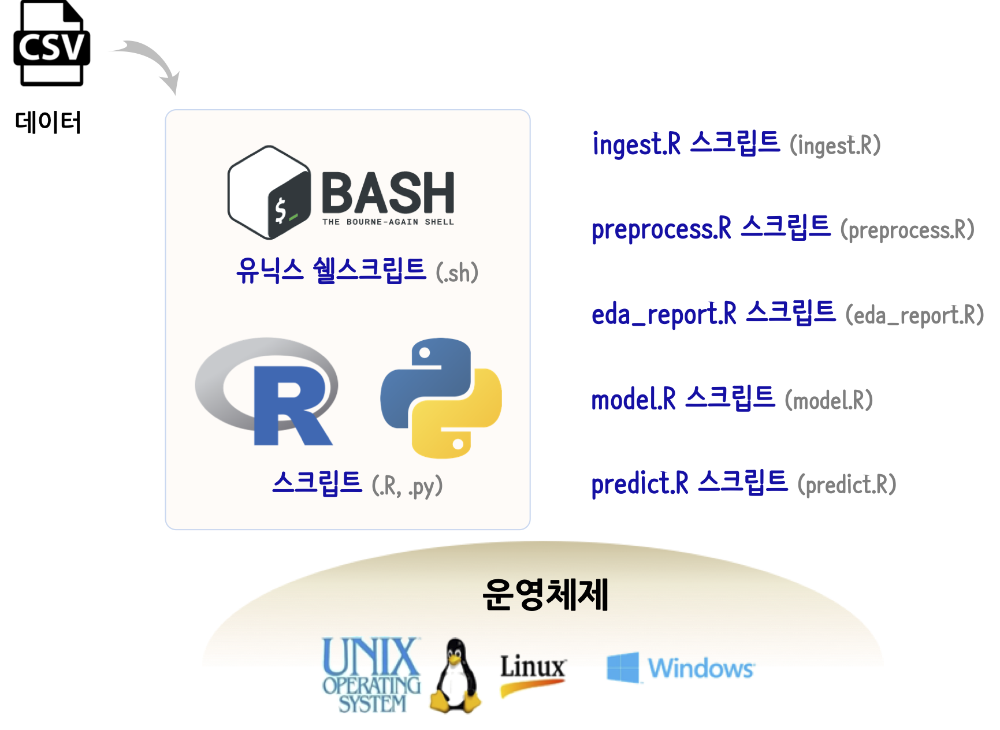
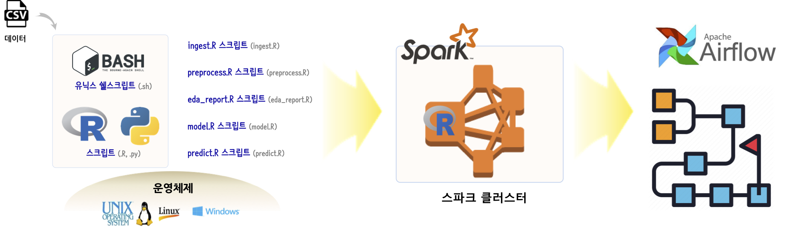

```{r setup, include=FALSE}
knitr::opts_chunk$set(echo = TRUE, message=FALSE, warning=FALSE,
                      comment="", digits = 3, tidy = FALSE, prompt = FALSE, fig.align = 'center')

library(reticulate)
use_condaenv("anaconda3")
# reticulate::repl_python()
```


# 데이터 엔지니어 [^data-science-infographic] {#data-engineering}

[^data-science-infographic]: [Data Science Infographics, Datacamp]( https://www.datacamp.com/community/tutorials/data-science-industry-infographic)

데이터 엔지니어는 데이터 과학자일을 편하게 만든다. 왜냐하면 데이터 과학자는 다음과 같은 일을 하기 때문이다.  

- 다양한 곳에 산재된 데이터를 한곳에 모아준다.
- 제대로 정제되지 않은 데이터를 깔끔하게 청소해준다. 예를 들어, 결측값 처리, 자료형 맞춤, 변수명 정합성 검증 등이 이에 포함된다.
- 이와 같이 깔끔한 데이터를 한곳에 모아두는 것에 그치지 않고 후속작업에 생산성을 높이도록 저장된 저장소 예를 들어 데이터베이스라고 하면 성능도 최적화 시켜준다.

한걸음 더 들어가면 데이터 엔지니어 Skill Set을 다음과 같이 표현할 수 있다.

- 확장성 있는(scalable) 데이터 아키텍처 설계, 개발, 운영
- 데이터 수집과 정제과정을 매끄럽고 깔끔하게 처리함.
- 제대로 정제되지 않은 데이터를 깔끔하게 청소하여 원재료로 쓸만하게 준비함.
- 클라우드 기술에 능숙함.

# 데이터 공학 도구{#data-engineering-tools}

상기 작업을 수행하는데 데이터 엔지니어가 사용하는 데이터 공학 도구를 다음과 같이 세가지로 분류할 수 있다.

- 정형/비정형 데이터베이스
    - PostgreSQL
    - MySQL
    - 구글 빅쿼리(BigQuery)
- 데이터 처리 (Processing)
    - 스파크(Spark)
    - 플린트(Flint)
- 스케쥴링(Scheduling)
    - 유닉스 쉘(bash) + 크론(cron)
    - 에어플로어(Airflow)
    - 오지(oozie)

{#id .class width="100%"}

# 클라우드 서비스 제공업체 {#data-engineering-clouds}

클라우드 서비스 제공업체는 전세계적으로 3개 업체가 손꼽힌다.

- AWS
- 마이크로소프트 Azure
- 구글 GCP

{#id .class width="100%"}


결국 클라우드 서비스 제공업체는 다음 세가지 서비스를 제공한다. 즉, 정형/비정형 데이터를 데이터 호수(Data Lake)에 담을 수 있는 저장소(Storage), 그리로 이를 처리할 수 있는 계산기능(Computation), 마지막으로 이렇게 처리된 데이터를 정형데이터 형태로 잘 저장할 수 있는 데이터베이스(DBMS)가 필요하다.

- 저장소 (Storage)
- 처리 (Computation)
- 데이터베이스 (Database)

| 클라우드 서비스 제공업체  |       핵심 서비스        |       서비스 명칭        |
|:-------------------------:|:------------------------:|:------------------------:|
| 아마존 (AWS)              | 저장소                   | S3                       |
| 마이크로소프트 (Azure)    | 저장소                   | Blob Storage             |
| 구글 (GCP)                | 저장소                   | Google Cloud Storage     |
| 아마존 (AWS)              | 처리(Computation)        | EC2                      |
| 마이크로소프트 (Azure)    | 처리(Computation)        | Virtual Machine          |
| 구글 (GCP)                | 처리(Computation)        | Compute Engine           |
| 아마존 (AWS)              | 데이터베이스             | RDS                     |
| 마이크로소프트 (Azure)    | 데이터베이스             | SQL Database             |
| 구글 (GCP)                | 데이터베이스             | Cloud SQl     |

# 데이터 처리 자동화 {#data-science-automation}

## 빅데이터 아닌 경우 {#data-science-auto-small}

리눅스 운영체제에 배쉬쉘을 사용하여 데이터 처리를 자동화할 경우 데이터 가져오는 단계부터 마지막 예측하여 활용하는 단계까지 모듈화시킬 수 있으며 이를 자동화한다. 이를 위해서 각 단계를 `.R`, `.py` 스크립트로 분리시키고 이를 배쉬쉘에서 불러 자동화시켜 처리한다.

- ingest.R 스크립트 (ingest.R)
- preprocess.R 스크립트 (preprocess.R)
- eda_report.R 스크립트 (eda_report.R)
- model.R 스크립트 (model.R)
- predict.R 스크립트 (predict.R)

{#id .class width="100%"}

## 빅데이터 경우 {#data-science-auto-big}

빅데이터의 경우 컴퓨터를 클러스터로 묶어 하둡/스파크에서 처리하는 것이 일반적이며 한번 처리하는 것이 아니고 매일 혹은 매주, 특정 시간을 반복적으로 사용하는 경우 [아파치 에어플로어(Apache Airflow)](https://airflow.apache.org/)를 많이 사용한다. 따라서, 빅데이터 처리를 위해서 스파크 하둡 클러스터로 돌려야 하고, 데이터 처리 자동화를 위해서 `cron` 대신에 airbnb에서 개발한 [아파치 에어플로어](https://airflow.apache.org/)를 도입하여 자동화 시킨다.


{#id .class width="100%"}
