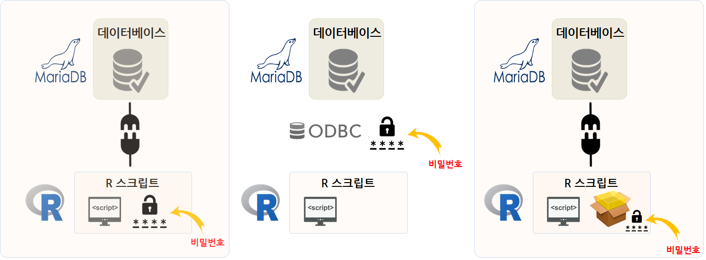

```{r setup, include=FALSE}
knitr::opts_chunk$set(echo = TRUE, message=FALSE, warning=FALSE,
                      comment="", digits = 3, tidy = FALSE, prompt = FALSE, fig.align = 'center')

library(reticulate)
use_condaenv("anaconda3")
# reticulate::repl_python()
```

데이터베이스를 외부에 별도로 두는 이유는 데이터가 크거나 데이터를 사용해야 되는 사용자나 시스템이 많기 때문에 그럴 것이다. 이런 경우 데이터베이스에 저장된 데이터를 R혹은 파이썬에서 접속하고자 하는 경우 다음과 같은 세가지 사례를 상정해 볼 수 있다.
R 스크립트 내부 혹은 `config` 팩키지에 별도로 떼어 데이터베이스에 접속하는 방법을 지정하는 것을 크게 하나로 묶을 수도 있고, ODBC를 가운데 두고 `DSN`을 통해 사용자명과 비밀번호를 숨기는 것도 윈도우 클라이언트에서 작업할 경우 좋은 방법이 될 것이다.



# 데이터베이스 - 마리아 DB (MariaDB) {#maria-db}

MySQL이 오라클로 넘어가면서 `MariaDB`가 만들어졌다. 
[MariaDB](https://mariadb.org/) 웹사이트에서 무료로 마리아DB를 다운로드 받아 설치한다.
윈도우의 경우 `mariadb-10.3.13-winx64.msi` 와 같이 확장자가 `.msi`를 갖는 파일을 받아 설치한다.
설치과정에 비밀번호를 꼭 등록한다.


## 예제 데이터베이스 설치 {#install-mariadb-sample}

마이아 DB가 설치되면 데이터베이스는 하나도 없이 깡통 데이터베이스관리시스템이 설치된 것이다.
따라서, 예제 혹은 실제 작업할 데이터베이스를 하나 추가해본다.

`MariaDB 10.2 (x64)` > `Command Prompt (MariaDB 10.2 ...)` 을 클릭하게 되면 `mysql` 명령어를 통해 
마리아DB 실행이 가능하다.

GitHub에서 [A sample MySQL database](https://github.com/datacharmer/test_db)를 `git clone` 명령어를 통해 복제하여 가져온다. 

``` {r git-clone-sample-database, eval=FALSE}
$ git clone https://github.com/datacharmer/test_db.git
Cloning into 'test_db'...
remote: Counting objects: 94, done.
remote: Total 94 (delta 0), reused 0 (delta 0), pack-reused 94
Unpacking objects: 100% (94/94), done.
Checking connectivity... done.
Checking out files: 100% (24/24), done.

$ cd test_db/
$ ls
.git/                          load_salaries1.dump
Changelog                      load_salaries2.dump
README.md                      load_salaries3.dump
employees.sql                  load_titles.dump
employees_partitioned.sql      objects.sql
employees_partitioned_5.1.sql  sakila/
images/                        show_elapsed.sql
load_departments.dump          sql_test.sh
load_dept_emp.dump             test_employees_md5.sql
load_dept_manager.dump         test_employees_sha.sql
load_employees.dump
```

데이터가 정상적으로 확인되었다면 다음 단계로 데이터베이스를 생성하여 본다.
`mysql -uroot -p` 명령어를 입력하게 되면 비밀번호를 넣게 되고 이미 준비된 `employees.sql` 파일을 통해 
`employees` 데이터베이스를 생성시킬 수 있다.

``` {r install-employees-database, eval=FALSE}
C:\test_db>mysql -uroot -p < employees.sql
Enter password: ****
INFO
CREATING DATABASE STRUCTURE
INFO
storage engine: InnoDB
INFO
LOADING departments
INFO
LOADING employees
INFO
LOADING dept_emp
INFO
LOADING dept_manager
INFO
LOADING titles
INFO
LOADING salaries
data_load_time_diff
00:01:06
```

## `employees` 데이터베이스 {#employees-database}

`employees` 데이터베이스가 정상적으로 생성되었는지는 `MariaDB 10.2 (x64)` > `MySQL Client (MariaDB 10.2 (x64))` 을 클릭하게 되면 바로 마리아DB CLI로 떨어진다. 앞서 생성시킨 비밀번호를 입력하여 데이터베이스를 확인한다.

``` {r run-mariadb-dbms, eval=FALSE}
Enter password: ****
Welcome to the MariaDB monitor.  Commands end with ; or \g.
Your MariaDB connection id is 14
Server version: 10.2.8-MariaDB mariadb.org binary distribution

Copyright (c) 2000, 2017, Oracle, MariaDB Corporation Ab and others.

Type 'help;' or '\h' for help. Type '\c' to clear the current input statement.

MariaDB [(none)]>
MariaDB [(none)]>
MariaDB [(none)]>
MariaDB [(none)]> SHOW databases;
+--------------------+
| Database           |
+--------------------+
| employees          |
| information_schema |
| mysql              |
| performance_schema |
| test               |
+--------------------+
5 rows in set (0.00 sec)

MariaDB [(none)]>
```


# 마리아DB에 R을 붙여본다. {#r-mariadb-connection}

마리아DB에서 데이터를 추출하여 R에서 작업하려면 텍스트 데이터로 마리아DB에서 뽑아내고 이를 다시 
R에서 불러 읽어오는 과정을 거쳐야 한다. 하지만 R 에서 `DBI` 팩키지를 사용할 경우 불필요하게 
중간에 TEXT 데이터를 만들 필요없이 R에서 직접 데이터프레임 변환이 가능하다. 

중간에 TEXT 데이터를 불필요하게 만드는 과정 대신에 `인증키(Credentials)`이 꼭 필요하다.

``` {r mariadb-r-connection}
# 0. 환경설정 ------------
library(DBI)
library(tidyverse)
library(extrafont)
loadfonts()

# 1. 데이터베이스 연결 ------------
conn <- dbConnect(RMySQL::MySQL(), 
                    user = "root",
                    password = "1234",
                    host = "localhost",
                    dbname = "employees")

dbListTables(conn)

# 2. 데이터프레임 변환 ------------

salary_df <- tbl(conn, "salaries")
head(salary_df)

salary_df %>% group_by(emp_no) %>% 
    summarise(mean_sal= mean(salary)) %>% 
    collect() %>% 
    ggplot(aes(x= mean_sal)) +
    geom_histogram() +
    theme_bw(base_family = "NanumGothic") +
    labs(x="평균 월급", y="직원 빈도수") +
    scale_x_continuous(labels = scales::comma) +
    scale_y_continuous(labels = scales::comma)

# 3. 데이터베이스 연결해제 ------------
dbDisconnect(conn)
```


# DSN(Data Source Name)을 통한 보안 {#r-mariadb-dsn}

`user = "root"`, `password = "1234"` 가 R 개발 코드에 그대로 노출되는 위험은 있지만,
순쉽게 데이터베이스에 붙어 분석이 가능한 장점이 있다. 
하지만, 이와 같이 코드를 작성하게 되면 비밀번호가 그대로 노출되어 누출될 경우 데이터베이스 전체가 위험에 빠질 수가 있다. R 개발자 관점에서도 정신건강에 무척이나 해롭다.


ODBC 연결이 누군가에 의해 먼저 설정된 경우 R 개발자 입장에서는 편리하다. 즉, `mariadb_employees` 같은 별명만 알고 있다면 
이를 바탕으로 데이터베이스에 접속해서 데이터를 뽑아내서 분석하는 것이 가능하기 때문이다.

데이터베이스에 접근권한이 있는 분이 윈도우7 데스크톱 혹은 서버를 예를 들면, `C:\Windows\System32\odbcad32.exe` 프로그램을 실행하여 **DSN(Data Source Name)**을 설정하고 내부적으로 필요한 접속서버, 사용자명, 비밀번호, 데이터베이스를 사전 설정시켜 놓는다.

만약 "MariaDB Connector/ODBC"가 설치되어 있지 않은 경우, [MariaDB Connector/ODBC 3.1.0 RC](https://downloads.mariadb.org/connector-odbc/3.1.0/) 웹사이트에서 다운로드 받아 설치하면 MySQL ODBC DSN을 볼 수 있게 된다.


R 개발자는 `Data Source Name`만 알면 되기 때문에 이 경우 `mariadb_employees` 사용자명과 비밀번호를 남기지 않게 된다.
따라서, R 스크립트에 보안관련 이슈를 데이터분석과 격리시킬 수 있다.

``` {r dsn-enforcement}
# 1. 데이터베이스 연결 ------------
con <- dbConnect(odbc::odbc(), "mariadb_employees")

dbListTables(con)

# 2. 데이터프레임 변환 ------------

emp_df <- tbl(con, "employees")
head(emp_df)

emp_df %>% collect() %>% 
    count(gender) %>% 
    mutate(gender_pcnt = scales::percent(n/sum(n)))

# 3. 데이터베이스 연결해제 ------------
dbDisconnect(con)
```


`Access denied for user 'root'@'localhost' (using password: YES)` 오류 [^mysql-odbc]

[^mysql-odbc]: [stackoverflow, "Access Denied for User 'root'@'localhost' (using password: YES) - No Privileges?"](https://stackoverflow.com/questions/17975120/access-denied-for-user-rootlocalhost-using-password-yes-no-privileges)

# `config.yml` 파일을 활용한 방법 {#r-config-yaml}

`install.packages("config")` 명령어로 `config` 팩키지를 설치하게 되면 
`config.yml` 파일 내부에 환경설정에 필요한 정보를 담을 수가 있다.

<style>
div.blue { background-color:#e6f0ff; border-radius: 5px; padding: 10px;}
</style>
<div class = "blue">

> **`config.yml` 파일** 
> 
> ``` {r config-yaml-file, eval=FALSE}
>
> default:
>  employees:
>    driver: 'MySQL' 
>    server: 'localhost'
>    uid: 'root'
>    pwd: '1234'  
>    port: 3306
>    database: 'employees'
> ``` 

</div>


config::get() 명령어를 통해 설정된 내용을 받아와서 이를 활용해서 데이터베이스에 접속하여 
데이터를 가져온다.

``` {r config-mariadb-connection}
# 0. 환경설정 ------------
library(config)

# 1. 데이터베이스 연결 ------------

(dw <- config::get("employees"))

con <- DBI::dbConnect(RMySQL::MySQL(), 
                      user = dw$uid,
                      password = dw$pwd,
                      host = dw$server,
                      port = dw$port,
                      dbname = dw$database)

dbListTables(con)

# 2. 데이터베이스 연결해제 ------------
dbDisconnect(con)
```

