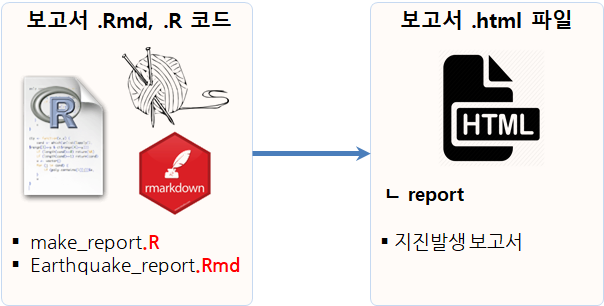

```{r setup, include=FALSE}
knitr::opts_chunk$set(echo = TRUE, message=FALSE, warning=FALSE,
                      comment="", digits = 3, tidy = FALSE, prompt = FALSE, fig.align = 'center')
```

{#id .class width="100%"}

# 지진발생보고서 자동생성 {#earthquake-cron-automate}

지진은 없어지는 것이 아니라 매분, 매시간, 매일 발생되기 때문에 주기적으로 [USGS - Earthquake Hazard Program - Spreadsheet Format](https://earthquake.usgs.gov/earthquakes/feed/v1.0/csv.php)에서 지진 데이터를 가져와서 이를 앞서 정의한 [지진데이터 `cron` 자동화: 보고서 생성](sw4ds-earthquake-make-report.html)에 맞춰 자동으로 생성시킬 필요가 있다.

이를 위해서 필요한 것이 [자동화 헬로월드 - `wsl` + `crontab`](sw4ds-automation-helloworld.html) 웹페이지에서 언급된 `cron`이라는 기능을 사용하는 것이다.


## 보고서 스크립트 생성 {#automate-eq-report}

앞선 [지진발생 자동보고서](#earthquake-crawling-report)를 CLI 배쉬쉘에서 다음 명령어로 생성을 자동화할 수 있다. 

```{r automate-report, eval=FALSE}
# cron-earthquake-rmd.R
# 0. 환경설정 ---------------------------------------
library(tidyverse)

# 1. 보고서 만들기 ---------------------------------------

rmarkdown::render("sw4ds-earthquake-make-report.Rmd", 
                output_format="html_document",
                params = list(province = province),
                output_file = str_c(paste0("earthquake_report_"), Sys.time(), ".html", sep=""),
                encoding = 'UTF-8', 
                output_dir = "report")
```

즉, `cron-earthquake-rmd.R`를 `Rscript` 명령어로 실행시키게 되면 강제로 `.html` 보고서를 생성시킬 수 있다.

```{r generte-report, eval=FALSE}
$ Rscript cron-earthquake-rmd.R 
```


{#id .class width="57%"}

## `crontab` 등록 {#automate-eq-crontab}

`crontab -e` 명령어로 `cron` 작업을 등록한다.
즉, 매시마다 작업할 cron 작업을 `0 * * * *`와 같이 지정한다.
그리고 지정된 시간에 맞춰 보고서를 생성하는 파일을 작성한다.

```{r automate-register-cron-job, eval=FALSE}
0 * * * * Rscript ~/swc/sw4ds/cron-earthquake-rmd.R 
```

## `crontab` 테스트 [^test-crontab]  {#automation-rscript-crontab-syntax}

[^test-crontab]: [stackexchnage, "Running a cron job manually and immediately"](https://serverfault.com/questions/85893/running-a-cron-job-manually-and-immediately)

`crontabl -l` 내용을 바탕으로 등록된 cron 명령어를 즉시 모두 실행시킬 수 있다.

- `crontab -l`: 등록된 모든 cron 명령
- `grep -v '^#'`: 주석 제거
- `cut -f 6- -d ' '`: cron 설정 모두 제거
- `while read CMD; do eval $CMD; done`: 등록된 cron 명령어 하나씩 실행

```{r rscript-file-exec-test, eval = FALSE}
$ crontab -l | grep -v '^#' | cut -f 6- -d ' ' | while read CMD; do eval $CMD; done
```

## `crontab` 실행확인 {#automate-eq-crontab-run}

`fs` 팩키지 `dir_ls()` 함수를 사용해서 `cron` 작업이 실행된 결과를 확인한다.

```{r automate-check-cron-job}
fs::dir_ls("report")
```

