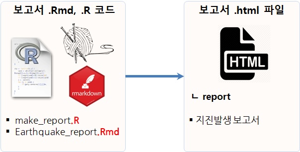

```{r setup, include=FALSE}
knitr::opts_chunk$set(echo = TRUE, message=FALSE, warning=FALSE,
                      comment="", digits = 3, tidy = FALSE, prompt = FALSE, fig.align = 'center')
```

{#id .class width="100%"}

# 지진발생 자동보고서 {#earthquake-crawling-report}

## 지진데이터 크롤링 {#earthquake-crawling}

[USGS - Earthquake Hazard Program - Spreadsheet Format](https://earthquake.usgs.gov/earthquakes/feed/v1.0/csv.php)에서 다양한 형태 지진 데이터를 얻어낼 수 있다.

- 시간별
- 일별
- 주별
- 월별

```{r eq-crawling}
library(tidyverse)
library(leaflet)

hour_dat <- read_csv("https://earthquake.usgs.gov/earthquakes/feed/v1.0/summary/all_hour.csv")
```

## 데이터 전처리 {#earthquake-preprocessing}

`tidyverse` 생태계 `readr` 팩키지에서 `read_csv()` 함수로 데이터를 가져올 경우 자료형 변환을 자동으로 하여 별도 전처리가 필요한 것은 아니다.
따라서, 시각화에 필요한 칼럼만 한정하는 것으로 데이터 전처리를 갈음한다.

```{r eq-preprocessing}
hour_df <- hour_dat %>% 
  select(time, latitude, longitude, depth, mag, place) 
```

## 깔끔한 데이터 {#earthquake-clean-data}

```{r eq-statistics}
hour_df %>% 
  DT::datatable()
```

## 시각화 {#earthquake-visualization}

```{r eq-visualization}
leaflet(data = hour_df) %>% 
  addProviderTiles(providers$OpenStreetMap) %>% 
  addMarkers(lng=~longitude, lat=~latitude, clusterOptions = markerClusterOptions(),
                   popup = ~ as.character(paste0("<strong> 지진 발생정보 </strong><br>",
                                                 "------------------------------<br>",
                                                 "&middot; 위치: ", `place`, "<br>",
                                                 "&middot; 강도: ", `mag`, "<br>",
                                                 "&middot; 깊이: ", `depth`, "<br>"
                   ))) 
```

# 보고서 스크립트 생성 {#automate-eq-report}

앞선 [지진발생 자동보고서](#earthquake-crawling-report)를 CLI 배쉬쉘에서 다음 명령어로 생성을 자동화할 수 있다. 

```{r automate-report, eval=FALSE}
# cron-earthquake-rmd.R
# 0. 환경설정 ---------------------------------------
library(tidyverse)

# 1. 보고서 만들기 ---------------------------------------

rmarkdown::render("sw4ds-automation-earthquake-cron-job.Rmd", 
                output_format="html_document",
                params = list(province = province),
output_file = str_c(paste0("earthquake_report_"), Sys.Date(), ".html", sep=""),
encoding = 'UTF-8', 
output_dir = "report")
```

즉, `cron-earthquake-rmd.R`를 `Rscript` 명령어로 실행시키게 되면 강제로 `.html` 보고서를 생성시킬 수 있다.

```{r generte-report, eval=FALSE}
$ Rscript cron-earthquake-rmd.R 
```


{#id .class width="57%"}
