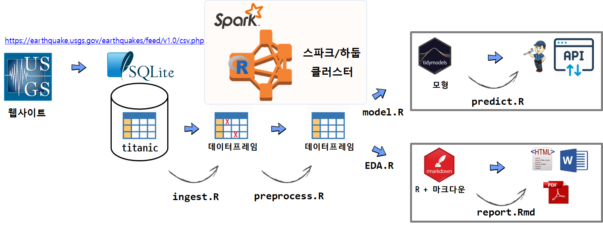

```{r setup, include=FALSE}
knitr::opts_chunk$set(echo = TRUE, message=FALSE, warning=FALSE,
                      comment="", digits = 3, tidy = FALSE, prompt = FALSE, fig.align = 'center')
```

{#id .class width="100%"}


|       데이터 과학자       |      데이터 엔지니어      |
|--------------------------|--------------------------|
| 데이터에서 패턴을 찾고 인사이트 도출   | 확장가능한 데이터 아키텍처 구축 |
| 설명가능한 통계 모형 혹은 기계학습을 통한 예측모형 | 데이터 수집과정을 간소화 |
| 대쉬보드 등을 통해 비즈니스 프로세스를 모니터링 | 클라우드 기술에 능통 |

# 데이터 가져오기 {#automation-ingest}

데이터는 다양한 형태로 저장되어 있다. 산재된 데이터는 분석을 통해 바로 직관적인 무언가를 얻기는 불가능하고,
더 큰 문제는 여러가지 이유로 인해 데이터가 깔끔하게 정제되지 않았다는 점이다.

따라서, 서로 다른 데이터 원천으로부터 가져와서 이를 분석이 용이한 형태로 가공을 하고, 
특히 결측값이나 기타 오염되고 더렵혀진 데이터를 깔끔하게 정제하여 분석이 용이한 관계형 데이터베이스에 저장한다.
즉, SQL 쿼리문을 던질 수 있어야 한다.


