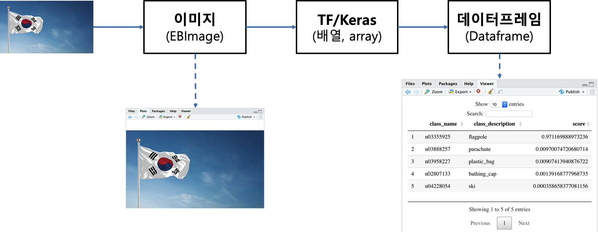

```{r setup, include=FALSE}
knitr::opts_chunk$set(echo = TRUE, message=FALSE, warning=FALSE,
                      comment="", digits = 3, tidy = FALSE, prompt = FALSE, fig.align = 'center')

library(reticulate)
use_condaenv("anaconda3")
# reticulate::repl_python()
```

# 사진속 사물인식 {#keras-object-recognition}

먼저 사진속 이미지를 컴퓨터로 인식시키기 위해서 인터넷에서 적당한 `.jpg`, `.png` 파일을 가져와서 로컬 컴퓨터 적당한 디렉토리에 저장시킨다. 그리고 나서 `EBImage` 팩키지를 사용해서 이미지를 R로 작업할 수 있는지 확인하기 위해서 또한, 시각적으로 파악하고자 불러온다.

그리고 나서 `keras` 팩키지를 사용해서 이미 이미지넷(imagenet) 학습데이터를 사용해서 `resnet50` 모형으로 이미지를 인식시킨다.



# 이미지 살펴보기 {#keras-object-view-image}

다양한 시각화 팩키지가 존재한다. 시각화 팩키지로 `EBImage`를 사용해서 R로 기계가 제대로 이미지를 가져오는지만 확인한다.

```{r read-image}
library(tidyverse)
library(EBImage)

flag_eb <- readImage("fig/Flag_of_South_Korea.jpg")

plot(flag_eb)
```

# 이미지 인식 {#keras-image-recognition}

사진속 사물을 `keras` API를 사용해서 인식해본다. 즉
이미지를 텐서플로우에 던져 이미 학습된 `resnet50` 사전학습 모형을 사용해서 이미지 인식을 시도한다.

`imagenet_decode_predictions()` 함수를 사용해서 이미지 작업 결과를 반환받아 이미지에 `flagpole`이 들어 있을 가능성이 가장 높다는 결과를 받아낸다.

```{r keras-image-result, eval=TRUE}
library(keras)

# 이미지 데이터를 TF 넣을 수 있는 `array` 형태로 변환
img <- image_load("fig/Flag_of_South_Korea.jpg", target_size = c(224,224))
x <- image_to_array(img)

x <- array_reshape(x, c(1, dim(x)))
x <- imagenet_preprocess_input(x)

# 이미지 예측 
model <- application_resnet50(weights = 'imagenet')
preds <- model %>% predict(x)

# 결과값 정리
img_df <- imagenet_decode_predictions(preds, top = 5)[[1]]
DT::datatable(img_df)
```

# 사물 인식 제품 [^shiny-keras-product]  {#keras-image-recognition-product}

[^shiny-keras-product]: [xwMOOC 데이터 제품, "이미지 분류 - 케라스(딥러닝)"](https://statkclee.github.io/data-product/shiny-image-classification.html)

R 언어로 기계가 이미지를 잘 인식하고 `keras`를 사용해서 이미지속 사물도 잘 분류해 내기 때문에 이를 제품화하여 다른 사용자가 사용할 수 있도록 한다. 이를 위해서 [xwMOOC 데이터 제품, "이미지 분류 - 케라스(딥러닝)"](https://statkclee.github.io/data-product/shiny-image-classification.html) 코드를 참조하여 `shiny` 웹을 개발한다.

먼저 `ui.R`, `server.R`, `global.R`로 앱을 나눠 이미지를 받아서 이미지속 사물을 인식한 결과를 출력하도록 `ui.R`을 준비한다. 그리고 이벤트를 받아 처리하는 로직을 `server.R`에 넣고, `global.R`에 이미지를 받아 `keras`를 활용하여 이미지 인식, 즉 분류하는 로직을 함수로 담아낸다.

```{r shiny-keras-webapp, eval=FALSE}
# global.R -------------------------------------------------------------------------

library(tidyverse)
library(shiny)
library(keras)
library(DT)

classify_image <- function(src_img){
  
  img <- image_load(src_img, target_size = c(224,224))
  x <- image_to_array(img)
  
  x <- array_reshape(x, c(1, dim(x)))
  x <- imagenet_preprocess_input(x)
  
  model <- application_resnet50(weights = 'imagenet')
  
  preds <- model %>% predict(x)
  
  # Table Output
  main_tbl <- imagenet_decode_predictions(preds, top = 5)[[1]]
  main_tbl$explore_class_on_imagenet <- sprintf('Explore %s on ImageNet', main_tbl$class_name, main_tbl$class_description)
  
  return(main_tbl)
}

# server.R -------------------------------------------------------------------------
server <- function(input, output, session) {
  
  output$uploaded_image <- renderImage({
    
    src <- input$img_file
    src <- src$datapath
    
    if (is.null(src)) {
      list(src = "www/Flag_of_South_Korea.jpg",
           height = "300",
           alt = "Classify Image")
    } else {
      return(list(
        src = src,
        height = "300",
        alt = "Classifed Image"
      ))
    }
    
  }, deleteFile = FALSE)
  
  output$keras_table <- DT::renderDataTable({
    
    uploaded_img_file <- input$img_file
    uploaded_img_path <- uploaded_img_file$datapath
    
    if (is.null(uploaded_img_path)) {
      if(input$flag_check) {
        withProgress(message = '사진 판별중...', value = 1,
                     classify_image("www/Flag_of_South_Korea.jpg")
        )
      } else {
        NULL   
      }
    } else {
      withProgress(message = 'Predicting...', value = 1,
                   img2tbl_df <- classify_image(uploaded_img_path)
      )
      DT::datatable(img2tbl_df)
    }
  })
}

# ui.R -------------------------------------------------------------------------
shinyUI(fluidPage(
  
  # Application title
  titlePanel("데이터 사이언스 언어 R - 기계 이미지 인식"),
  
  # Sidebar with a slider input for number of bins 
  sidebarLayout(
    sidebarPanel(
      # Image Input: Select a file ----
      fileInput("img_file", "Choose Image file: ", accept = c('image/png', 'image/jpeg')),
      
      # Horizontal line ----
      tags$hr(),
      
      # Check Keon-Woong Moon image ----
      checkboxInput("flag_check", "기본 예제 사진(태극기)", FALSE)
    ),
    
    # Show Image & Keras Output
    mainPanel(
      imageOutput("uploaded_image", height = 300),
      DT::dataTableOutput("keras_table")
    )
  )
))

```


