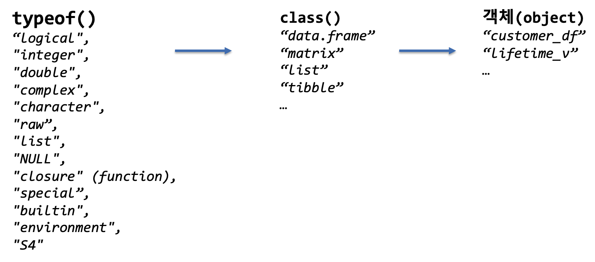

```{r setup, include=FALSE}
knitr::opts_chunk$set(echo = TRUE, message=FALSE, warning=FALSE,
                      comment="", digits = 3, tidy = FALSE, prompt = FALSE, fig.align = 'center')

library(reticulate)
use_condaenv("anaconda3")
# reticulate::repl_python()
```

# 객체지향 프로그래밍은 언제 필요할까? {#r-oop}

객체지향 프로그래밍과 함수형 프로그래밍은 데이터 사이언스에서 중요한 두가지 프로그래밍 패러다임이다.
크게, 함수형 프로그래밍은 데이터를 분석할 때 좋고, 객체지향 프로그래밍은 도구를 만들 때 적합하다고 한다.

함수형 프로그래밍은 함수를 먼저 생각하고 자료구조가 뒤따르지만, 
객체지향 프로그래밍에서는 자료구조를 먼저 생각하고 함수(메쏘드)가 그 다음에 따라오고,
한정된 객체(object)로 기술된 작업을 수행하는데 적합하다.

OOP의 중요한 원칙 중 하나는 다른 객체에 대해서 다르게 동작하는 것이다.

# R OOP 시스템 [^r6-class-system] {#r-oop-system}

[^r6-class-system]: [Winston Chang (2017, 7 11), "The R6 Class System", useR! International R User 2017 Conference](https://channel9.msdn.com/Events/useR-international-R-User-conferences/useR-International-R-User-2017-Conference/The-R6-Class-System)

R은 뿌리를 두고 있는 S시절 1980년대부터 9개의 서로 다른 OOP 시스템이 만들어졌다.
Functional OOP 개념으로 S3로 개발된 것이 많고 이를 좀더 진화시켜 bioconductor 분야에서 S4가 많이 사용되고 있으며 2010년대 중반 Winston Chang이 R6를 개발하여 많은 개발자들에게 친숙한 OOP 개념도 R에 도입되었다.

- 가장 기본인 OOP 개념 구현, 안정된 시스템
    - Functional OOP
    - S3
- 게놈 데이터 특화 bioconductor
    - S4
- 캡슐화, 상속 등 OOP 핵심 기능 구현, 안정된 시스템
    - 친숙한 자바, 파이썬 등 객체지향 언어를 R로 구현
    - R6
- 잘 사용되지 않는 사실상 죽은 시스템
    - ReferenceClasses, OOP, R.oo, mutatr, R5, proto

| Functional OOP | 캡슐화된 OOP |
|-------------------------|-------------------------|
| 객체가 데이터를 포함    | 객체가 데이터와 메쏘드를 포함 |
| 객체는 변경가능하지 않음(immutable) | 객체는 변경가능함(mutable) |
| 클래스 메쏘드가 객체와 분리됨  | 우리가 알고 있는 전형적인 OOP |
| `summary(x)`       | `x$summary()` |
| `x <- modify(x)`   | `x$modify()`  |
| Functional OOP는 코딩 로직을 따라가기 쉽다. | 갭슐화된 OOP는 시간에 따라 진화되는 데이터를 표현하는데 유용함. |

R6는 `Reference Class`와 마찬가지로 캡슐화된 OOP 시스템으로 `Reference Class`가 가졌던 성능적인 이슈를 해결한 아주 간결한 OOP 팩키지로 `shiny` 팩키지 Shiny 세션, `dplyr` DB 연결, `processx` 시스템 프로세스 구현에 사용되고 있다.

# 함수의 종류와 자료형 {#r-oop-function-data-type}

함수의 종류와 자료형을 파악하는 것은 데이터 분석과 도구 개발의 기초라고 볼 수 있다.

함수의 종류는 R에서 다음과 같이 세가지로 나눠진다.

- 함수의 종류
    - 대부분의 함수는 클로저(closure)로 불린다.
    - `length()`와 같은 함수는 내장함수로 불린다.
    - `if`, `while`도 함수인데, 특수(special) 함수로 불린다.

더불어 자료형을 파악해 나가는 것은 프로그래밍에 한걸음 더 나아간다는 의미가 된다.
자료형 확인을 위해서 `class()`와 `typeof()`가 많이 사용되지만,
`mode()`, `storage.mode()`는 S언어와 호화성 측면에서 함께 사용된다.

```{r data-type-function}
library(tidyverse)

check_type <- function(x) {
  tibble(class = class(x), 
         typeof = typeof(x), 
         mode = mode(x), 
         storage.mode = storage.mode(x))
}

integer_vec <- rpois(7, lambda = 3)

check_type(integer_vec)
check_type(length)
check_type(mean)
check_type(`if`)
```

# 클래스 다중 정의(overloading)  {#r-oop-function-data-type}

정규분포에서 나온 표본은 "numeric"이지만, `class`로 다중정의(overloading)하게 되면 
`typeof()`를 통해 "double"이 변경되지 않지만 클래스가 바뀐 것이 확인된다.

```{r r-oop-class-overloading}
rs_v <- rnorm(10)
class(rs_v)
typeof(rs_v)

class(rs_v) <- "정규분포_표본"
rs_v
typeof(rs_v)
```

logical, integer... 등과 같은 원초적인 자료형이 있고 이를 모아 놓은 다양한 클래스가 R에 존재한다. 대표적인 클래스가 `data.frame`을 들 수 있다.



# 메쏘드 vs 함수 {#oop-method-vs-funciton}

함수형 프로그래밍에서는 함수(funciton)을 먼저 생각하는데 데이터 분석하는 경우에 요이하고, 객체지향 프로그래밍(OOP)에서는 자료구조를 먼저 생각하기 때문에 개발에 적합하다. 그렇다고 객체지향 프로그래밍을 모든 문제에 해결하는데 적합하지 않고 복잡하지만 한정된 객체가 존재하는 경우 적합하게 사용할 수 있다.

결국 프로그래밍은 자료구조와 함수를 아우르게 되는데 동일한 개념도 프로그래밍 패러다임에 따라 달리 사용된다. 대표적으로 OOP 문맥에서 함수를 메쏘드(method)라는 용어를 사용한다.


